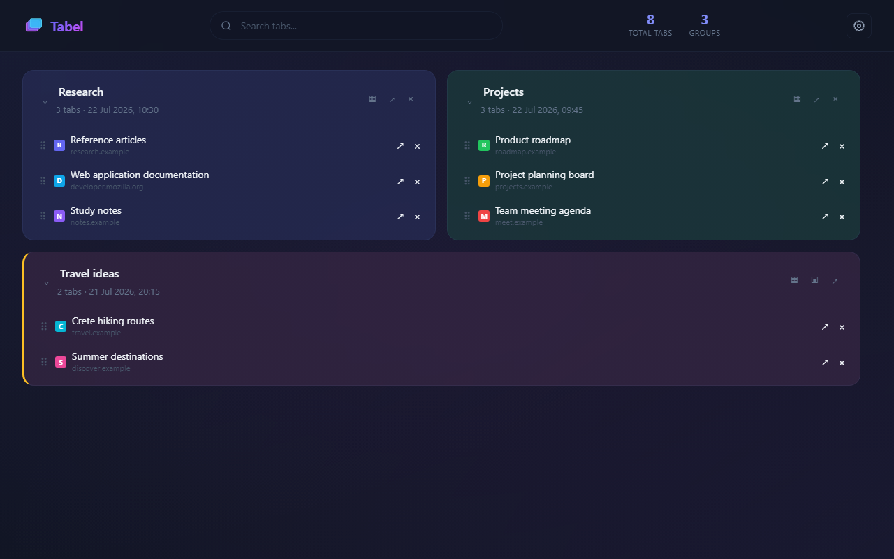

# Tabel

Tabel is a Chrome extension that saves and organizes open tabs into visual groups.

Version 1.6.0. Manifest V3. English interface.

[Official website](https://kyriakosgian.github.io/Tabel/) | [Report a problem](https://github.com/KyriakosGian/Tabel/issues) | [Releases](https://github.com/KyriakosGian/Tabel/releases)



## Features

- Save non-pinned tabs from the active window.
- Save the most recent tab, selected open tabs, or eligible tabs from every window, then close them after successful persistence.
- Add captured tabs to the top of an existing unlocked group.
- Save a page or link from the Chrome context menu and send a link to a new or existing group.
- Keep only the newest saved copy when the same URL is captured again.
- Restore one tab or a complete group.
- Search, rename, delete, sort, and move groups and tabs.
- Hide tab URLs or show a domain or complete address.
- Customize density, font size, favicon size, default group width, and group layout.
- Use System, Light, or Dark theme with a live appearance preview.
- Sync saved groups through `chrome.storage.sync`.
- View saved-tab statistics, the last successful sync, and current sync quota usage.
- Import and export JSON backups.

## Local installation

1. Open `chrome://extensions/` in Chrome.
2. Enable Developer mode.
3. Select Load unpacked.
4. Select the project root directory.

## Tests

Node.js 22 or later is required.

```bash
npm test
```

The test suite uses the built-in `node:test` runner and requires no third-party packages.

## Public release

- `docs/` contains the GitHub Pages website, privacy policy, and support page.
- `release/` contains the Chrome Web Store copy, graphic assets, and release notes.
- `npm run build:release` creates a clean Chrome Web Store ZIP in `dist/`.
- GitHub Actions runs the test suite for every push and pull request.
- A version tag such as `v1.6.0` creates a GitHub Release and attaches the Store ZIP.

## Create a release

```bash
npm test
npm run build:release
git tag v1.6.0
git push origin v1.6.0
```

The tag must match the versions in `manifest.json` and `package.json`.

## Project structure

```text
Tabel/
|-- background.js
|-- manifest.json
|-- dashboard/
|-- options/
|-- styles/
|-- icons/
|-- _locales/
|-- docs/
|-- release/
|-- scripts/
`-- tests/
```

## Data storage

- IndexedDB stores groups and tabs.
- `chrome.storage.local` stores settings, privacy consent, sync status, a context-menu group index, and crash-safe pending capture data.
- `chrome.storage.sync` synchronizes saved groups between Chrome installations.
- Website icons are rendered through Chrome's favicon API and are not stored or synchronized.

## License

Tabel is released under the [MIT License](LICENSE).
