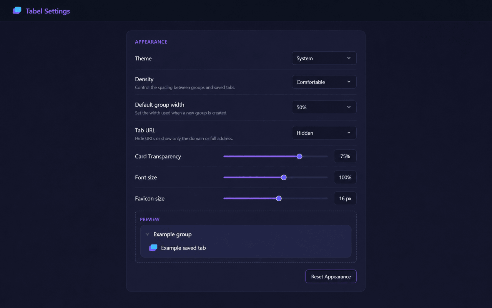

# Tabel

Tabel is a Chrome extension that saves and organizes open tabs into visual groups.

Version 2.0.0. Manifest V3. English interface.

[Add to Chrome](https://chromewebstore.google.com/detail/tabel-tab-manager/hmdklfckhfiobokdglandjdndgaefngd) | [Official website](https://kyriakosgian.github.io/Tabel/) | [Report a problem](https://github.com/KyriakosGian/Tabel/issues) | [Releases](https://github.com/KyriakosGian/Tabel/releases)




## Features

- Save non-pinned tabs from the active window.
- Save the most recently active eligible tab, selected open tabs, or eligible tabs from every window, then close them after successful persistence.
- Add captured tabs to the top of an existing unlocked group.
- Save a page or link from the Chrome context menu and send a link to a new or existing group.
- Keep only the newest saved copy when the same URL is captured again.
- Restore one tab or a complete group.
- Search, rename, delete, sort, and move groups and tabs.
- Hide tab URLs or show a domain or complete address.
- Customize density, font size, favicon size, default group width, and group layout.
- Use System, Light, or Dark theme with a live appearance preview.
- Sync saved groups through `chrome.storage.sync`.
- View saved-tab statistics, the time of the last successful sync storage operation, and current sync quota usage.
- Import and export JSON backups.

## Installation

Install Tabel for free from the [Chrome Web Store](https://chromewebstore.google.com/detail/tabel-tab-manager/hmdklfckhfiobokdglandjdndgaefngd). Select **Add to Chrome** and confirm the installation. Developer mode is not required.

## Development

Local installation is intended for development and testing.

1. Clone this repository or download and extract a package from [GitHub Releases](https://github.com/KyriakosGian/Tabel/releases).
2. Open `chrome://extensions/` in Chrome and enable Developer mode.
3. Select Load unpacked and choose the directory containing `manifest.json`.
4. After editing the code, reload the extension from `chrome://extensions/`.

### Tests

Node.js 22 or later is required.

```bash
npm test
```

The test suite uses the built-in `node:test` runner and requires no third-party packages.

## Public release

- `docs/` contains the GitHub Pages website, privacy policy, and support page.
- `release/` contains the Chrome Web Store copy, graphic assets, and release notes.
- `npm run build:release` creates a clean Chrome Web Store ZIP in `dist/`.
- GitHub Actions runs the test suite for every push and pull request.
- Pushing a new version tag creates a GitHub Release and attaches the Store ZIP.

## Create a release

For a future extension update, first set a new version in `manifest.json` and `package.json` and update the changelog and release notes. Run these checks in PowerShell on Windows:

```powershell
npm test
npm run build:release
```

Commit and push the changes, then create and push a new Git tag with `v` followed by that version. Do not reuse an existing release tag. Documentation-only changes do not require a version change, a new tag, or a new Store package.

## Project structure

```text
Tabel/
|-- background.js
|-- manifest.json
|-- dashboard/
|-- options/
|-- styles/
|-- icons/
|-- _locales/
|-- docs/
|-- release/
|-- scripts/
`-- tests/
```

## Data storage

- IndexedDB stores groups and tabs.
- `chrome.storage.local` stores settings, privacy consent, sync status, a context-menu group index, and crash-safe pending capture data.
- `chrome.storage.sync` synchronizes saved groups between installations with the same extension ID and Google Account when Chrome sync is enabled.
- The Settings label "Last successful sync" reports the last successful operation with Chrome's sync storage on this device. It does not confirm that another device has received the data.
- Chrome sync provides approximately 100 KB for saved data, deletion records, and sync metadata. Settings shows quota usage. Tabs remain local if a sync write fails.
- Website icons are rendered through Chrome's favicon API and are not stored or synchronized.
- The public manifest key identifies the extension. It is not a password or a credential for accessing another user's data.

## License

Tabel is released under the [MIT License](LICENSE).
